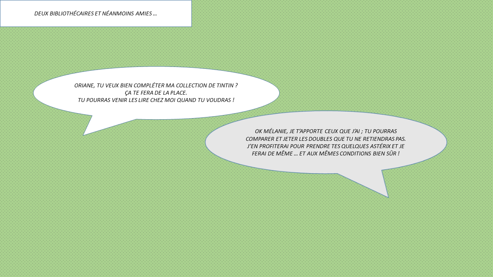
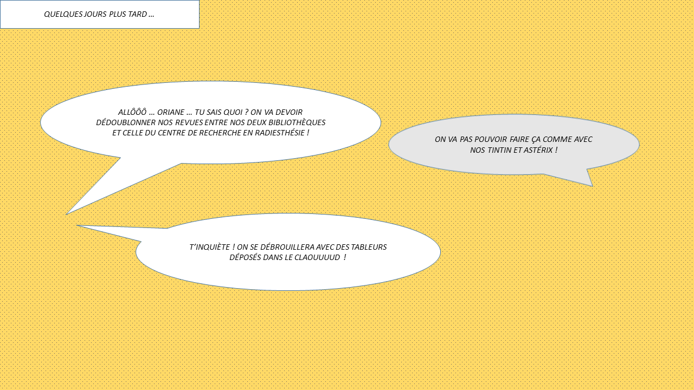
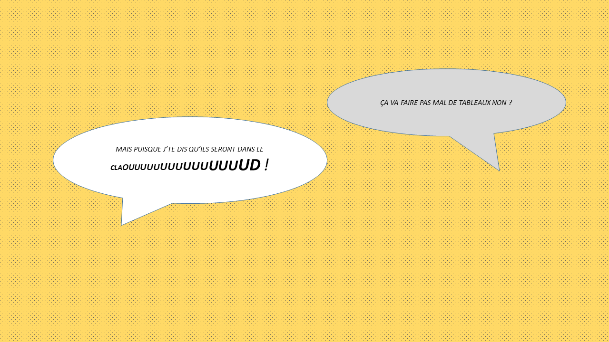
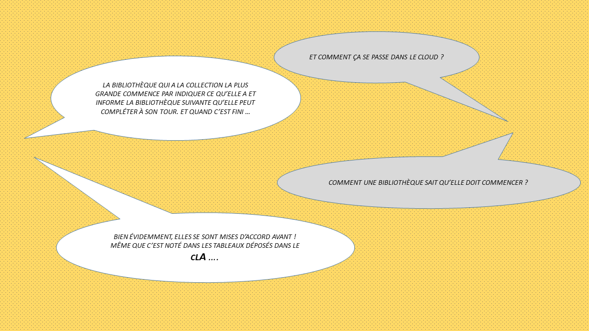

# Une BD pour comprendre :

# AppliWeb collaborative pour gérer le dédoublonnement des revues dans les bibliothèques :

Gagnez de l'espace en éliminant vos doublons, offrez une meilleure lisibilité de vos ressources en reconstituant pour chacune d'elles une collection unique la plus intègre possible résultant de l'agrégation des éléments épars disponibles dans vos bibliothèques.

# Méthode :

Pour une ressource donnée (Unité catalographique sans les filiations), l'application eplouribousse permet aux bibliothèques, chacune à son tour, d'indiquer ses éléments reliés contribuant à la résultante, puis lors d'un deuxième cycle d'instructions et selon la même logique, ses éléments non-reliés complémentaires.

L'ordre de traitement est significatif : La première bibliothèque est normalement celle détenant déjà la collection la plus importante (Celle qui revendique la conservation dans l'hypothèse où la collection est finalement regroupée). C'est la même logique d'importance qui doit prévaloir normalement pour la place revendiquée par les bibliothèques suivantes. Il peut arriver qu'une bibliothèque veuille soustraire sa collection à la reconstitution de la résultante (Le cas typique est celui d'une collection du dépôt légal) Le module de positionnement de l'application eplouribousse rend cette dérogation possible.

Les fiches obtenues décrivent les résultantes ; les éléments écartés s'en déduisent. Les parties contribuant à la collection résultante peuvent être regroupées ou pas, au choix. Les traitements physiques et mises à jour catalographiques sont à prévoir.

Voir une illustration : https://seafile.unistra.fr/f/163d60a568e2482092e3/

# Fonctionnalités :

01. édition des candidats pour chaque bibliothèque participante,
02. formulaire de positionnement (ou de dérogation),
03. édition des ressources dont l'instruction de la résultante peut débuter,
04. alertes possibles (positionnement, arbitrage, instruction, résultante),
05. formulaires d'instruction (ajout, suppression, modification, fin),
06. édition différenciée des résultantes (rapports soignés au format pdf),
07. contrôle de conformité à la fin de chaque cycle d'instruction,
08. prise en charge complète de la chaîne de traitement,
09. tableau de suivi d'activité,
10. recherche croisée par ressource et bibliothèque,
11. gestion des utilisateurs,
12. contrôles d'authentification,
13. paramétrage des motifs de dérogation,
14. administration des cas de fiches défectueuses,
15. internationalisation (anglais et allemand en cours, extension possible à d'autres langues),
16. formulaires de contact de l'administrateur de l'instance et du développeur,
17. possibilité d'exporter les principales listes au format csv,
18. gestion autonome du mot de passe,
19. réglage privé / public pour les simples consultations.

# Démo :

https://seafile.unistra.fr/f/c2e9ec44798f490087f7/

# Plus d'info :

Voir le manuel de l'appli : https://git.unistra.fr/gressot/yellow/-/blob/master/static/doc/User_Documentation.pdf

Visionner les vidéos de présentation (à télécharger si vous n'arrivez pas à visionner complètement) : 
01. Hypothèses et définitions : https://seafile.unistra.fr/f/dd5b8a16b1a5440389e5/
02. Méthode : https://seafile.unistra.fr/f/590ba4359f3e4b73b60e/
03. Préparation de la base de données : https://seafile.unistra.fr/f/9581ffba08f24e849b08/
04. Exemple d'un traitement de bout en bout : https://seafile.unistra.fr/f/b87faa2857ee42bab57f/
05. Administration du site : https://seafile.unistra.fr/f/d3f6a23f94804dfabddd/
06. Crédits : https://seafile.unistra.fr/f/579d874730604579b073/

# Comment profiter d'eplouribousse ?

La version 2 d’eplouribousse a été développée dans l’idée d’affranchir les établissements porteurs de projet de toute opération de déploiement d’une instance propre. Les établissements n’ont plus qu’à mettre à disposition leur base de données projet.

N’ayant pas encore subi l’épreuve d’une mise en production en situation réelle, cette version doit être considérée comme une version en beta test fermée telle que définie dans l’article Wikipedia « version d’un logiciel » : « version dans laquelle les personnes intéressées par le produit doivent s'inscrire au préalable ou sont contactées par les concepteurs du produit testé qui sélectionnent les candidatures. »

Les objectifs principaux de la phase beta test sont les suivants :
-	Mettre en évidence d’éventuels bogues
-	Corriger d’éventuels défauts majeurs de l’interface utilisateur
-	Observer l’effet d’une montée en charge de la volumétrie des projets supportés par une seule instance (en théorie, une instance peut admettre jusqu’à 100 projets i.e. 100 bases de données)

Vous êtes curieux : visitez l'instance de beta test : https://sbu-eplouribousse.unistra.fr/

Vous avez un projet de dédoublonnement de revues papier dans votre établissement : contactez-nous (voir au bas de cette page).

# Crédits :

eplouribousse utilise des données sous licence ouverte etalab fournies par l'Agence bibliographique de l’Enseignement supérieur.

# Licence :

- eplouribousse est sous licence BSD 3-Clause Clear.
- eplouribousse is licensed under the terms of the BSD 3-Clause Clear License.

# Contact :

Indiqué en https://github.com/GGre/eplouribounistra/blob/master/Doc/contact.txt

